# kwin-vr Workflows

Flow charts for every known activation, deactivation, and error path in the kwin-vr
system. Both the custodian daemon and the KWin plugin are shown side-by-side where
they interact.

---

## 1. System Startup (Custodian)

The custodian starts automatically as a user systemd unit. It performs a synchronous
hardware scan before entering event-loop mode.

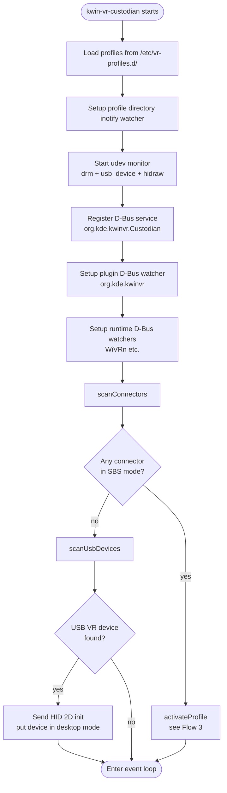

---

## 2. Custodian Event Loop — Incoming Events

Once started, the custodian is entirely event-driven. Nothing polls.

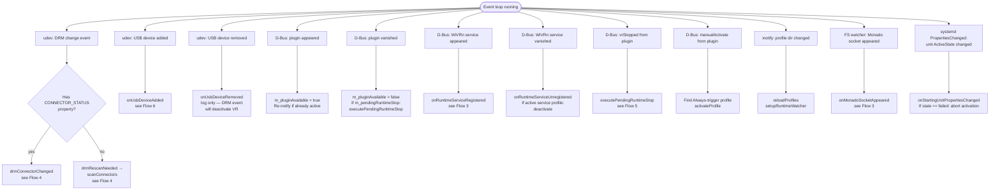

---

## 3. VR Activation Flow (Custodian + Plugin)

Triggered by: SBS mode detected, WiVRn service appeared, or manual activate.

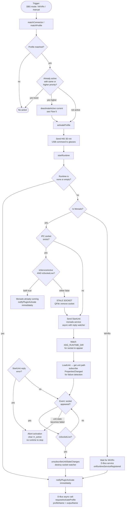

### Plugin side of activation

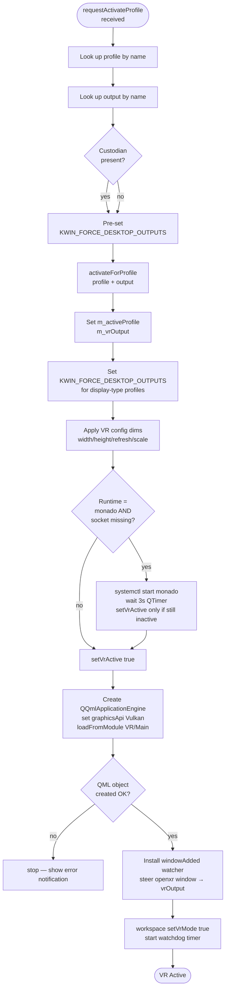

---

## 4. SBS Button Press Detection

Specific to EDID-triggered profiles (e.g. Xreal Air). NVIDIA does not emit
`CONNECTOR_STATUS` on mode changes — the custodian handles this explicitly.

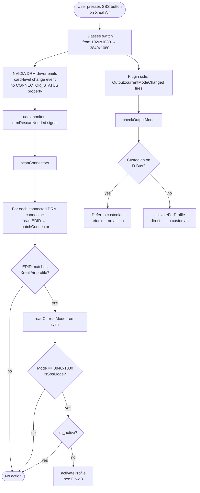

---

## 5. VR Deactivation Flow (Custodian + Plugin)

**Critical NVIDIA constraint:** Monado must never receive `StopUnit` while the display
is still in SBS mode. The GPU deadlocks during Vulkan compositor cleanup in that state.
The deferred-stop pattern enforces this ordering.

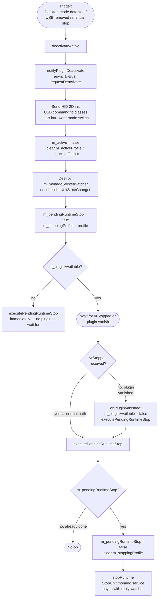

### Plugin side of deactivation

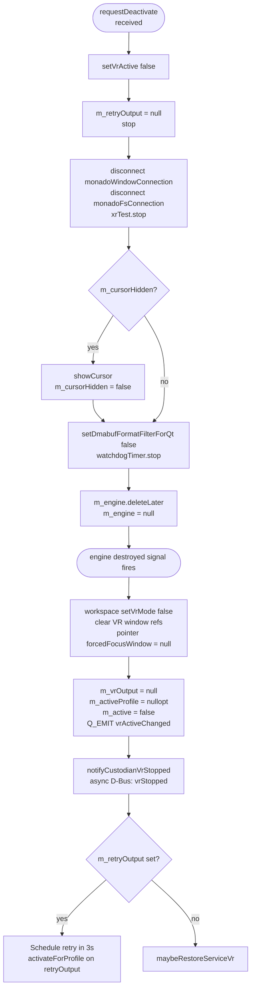

---

## 6. USB Hotplug Flow

Handles USB device connect/disconnect, avoiding accidental 2D HID resets during VR.

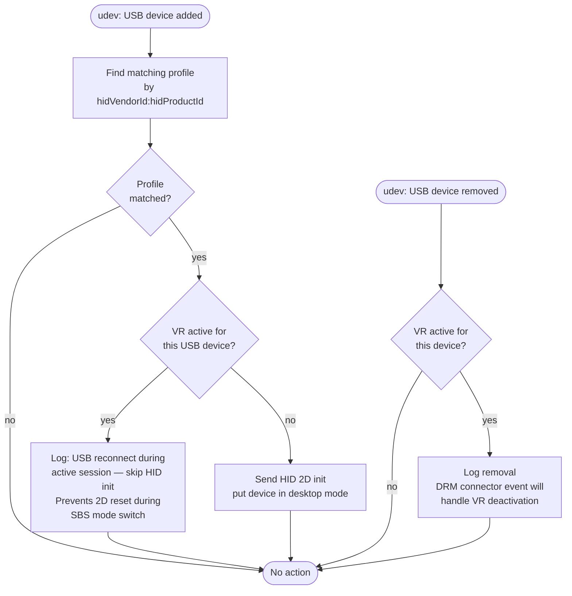

---

## 7. Monado Socket Lifecycle

Detailed view of the startup monitoring introduced to fix stale-socket freezes.

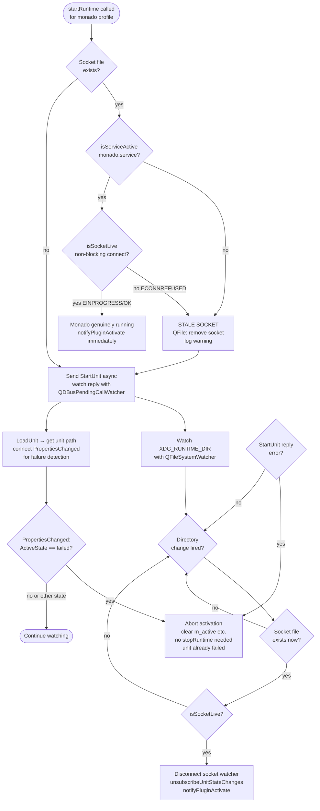

---

## 8. Profile Priority and Preemption

When two profiles could match simultaneously (e.g. WiVRn running while SBS button pressed).

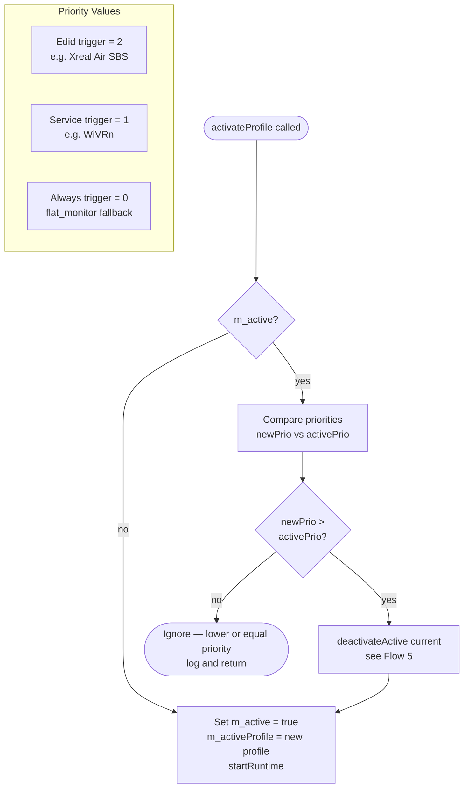

---

## 9. Plugin Output Mode Monitoring

The plugin independently watches outputs for mode changes. When the custodian is
present, the plugin defers all SBS-triggered activation to the custodian.

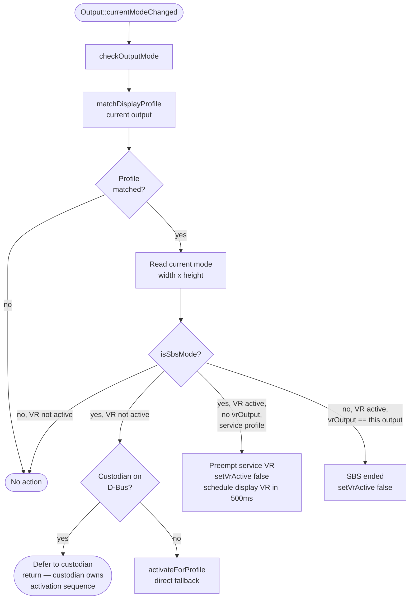

---

## 10. Custodian–Plugin D-Bus Interface Summary

All inter-process communication between the custodian and plugin.

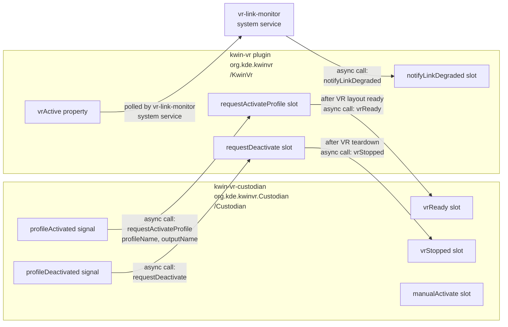

---

## Invariants — Never Violate These

| # | Invariant | Why |
|---|-----------|-----|
| 1 | `stopRuntime()` is called **only** from `executePendingRuntimeStop()` | Ensures Monado is never stopped before plugin confirms VR teardown |
| 2 | `executePendingRuntimeStop()` is guarded by `m_pendingRuntimeStop` | Prevents double-stop if both vrStopped() and onPluginVanished() fire |
| 3 | `isSocketLive()` is called before trusting any existing `monado_comp_ipc` | Stale socket from SIGKILL'd Monado must not trigger premature plugin notification |
| 4 | `scanConnectors()` runs before `scanUsbDevices()` at startup | If already in SBS mode, m_active = true before USB scan so 2D HID init is skipped |
| 5 | `onUsbDeviceAdded()` skips HID init if `m_active && VID:PID matches active profile` | Prevents 2D reset during SBS mode USB reconnect (glasses mid-switch) |
| 6 | `monado.service` has no `[Install]` section | Must not be enabled; custodian owns its lifecycle |
| 7 | `XRT_COMPOSITOR_FORCE_WAYLAND=1` must never be in monado.service | Forces Vulkan Wayland compositor path that is invalidated by KWin output changes on NVIDIA |
| 8 | Headset output repositioning block stays removed from `kwinvrhelpers.cpp` | Atomic modeset position change on physical connectors fails with SIGSEGV on RTX 2070 |
